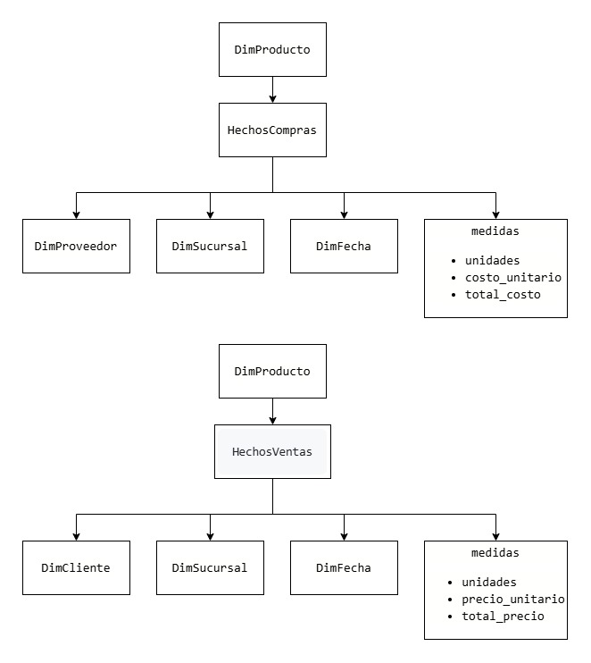
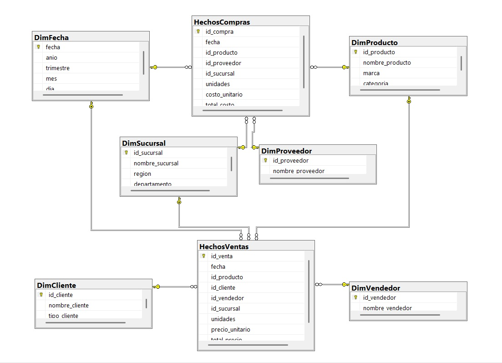

# SG-FOOD – Proceso ETL y Modelo Multidimensional (Constelación)

## 📌 Descripción del Proyecto

Este proyecto tiene como objetivo implementar un proceso ETL completo para la empresa SG-FOOD, dedicada a la comercialización de productos alimenticios en distintas sucursales del país. A partir de los archivos `compras.csv` y `ventas.csv`, se diseñó un modelo de inteligencia empresarial basado en un **modelo de constelación**, cargado a una base de datos SQL para facilitar análisis OLAP posteriores.

---

## 🧠 Conceptos

### 🔷 OLAP (Online Analytical Processing)
OLAP es una tecnología utilizada para realizar análisis multidimensionales de grandes volúmenes de datos. Permite operaciones como:

- **Slice:** filtrar una dimensión específica (ej. un año)
- **Dice:** aplicar filtros sobre múltiples dimensiones (ej. producto y región)
- **Drill-down / Roll-up:** analizar datos en mayor o menor nivel de detalle (jerarquías)
- **Pivot:** rotar dimensiones para diferentes perspectivas

### 🔶 Dimensiones
Son los contextos desde los cuales se analiza un hecho. Ejemplos: producto, cliente, tiempo, sucursal.

### 🔶 Medidas
Son los valores cuantitativos que se analizan. Ejemplos: unidades, costos, precios, totales.

### 🔶 Jerarquías
Permiten organizar los atributos de una dimensión en niveles. Ejemplos:

- **DimFecha:** Año → Trimestre → Mes → Día
- **DimSucursal:** Región → Departamento → Sucursal

---

## 🧩 Diseño del Modelo Multidimensional

### 📐 Modelo Constelación

Se eligió este modelo porque la empresa necesita analizar **dos procesos de negocio** (ventas y compras), los cuales comparten dimensiones como **producto**, **fecha** y **sucursal**, y requieren análisis cruzado (como productos que generan pérdidas).

### 📊 Diagrama lógico:

---

### 📊 Diagrama entidad relación:

---

## 📄 Script SQL del Modelo

El archivo [`script.sql`](./DB/script.sql) contiene el diseño completo del modelo multidimensional modelo constelación implementado para SG-FOOD. Este script:

- Crea la base de datos `BD_SG_FOOD`.
- Define las tablas de dimensiones (`DimProducto`, `DimCliente`, etc.) y sus jerarquías.
- Define las tablas de hechos `HechosCompras` y `HechosVentas`.
- Establece relaciones entre hechos y dimensiones mediante claves foráneas.
- Calcula automáticamente los totales (`total_costo`, `total_precio`) en cada hecho.

---

## 🧾 Justificación de Tablas, Atributos y Jerarquías

### 🔹 Tablas de Hechos

#### HechosVentas
- Representa cada transacción de venta realizada por SG-FOOD.
- **Atributos clave:** `unidades`, `precio_unitario`, `total_precio`.
- Se relaciona con las dimensiones: `producto`, `cliente`, `vendedor`, `sucursal` y `fecha`.

#### HechosCompras
- Representa cada transacción de compra realizada por SG-FOOD.
- **Atributos clave:** `unidades`, `costo_unitario`, `total_costo`.
- Se relaciona con las dimensiones: `producto`, `proveedor`, `sucursal` y `fecha`.

---

### 🔹 Tablas de Dimensión

#### DimProducto
- Contiene información descriptiva del producto.
- **Atributos:** `nombre_producto`, `marca`, `categoría`.
- Se utiliza para análisis por tipo o marca de producto.

#### DimSucursal
- Describe la ubicación geográfica de cada sucursal.
- **Atributos:** `nombre_sucursal`, `departamento`, `región`.
- **Jerarquía:** Región → Departamento → Sucursal.

#### DimFecha
- Detalla el tiempo asociado a cada transacción.
- **Atributos:** `año`, `trimestre`, `mes`, `día`.
- **Jerarquía:** Año → Trimestre → Mes → Día.

#### DimCliente
- Representa a los clientes que compran productos.
- **Atributos:** `nombre_cliente`, `tipo_cliente` (Mayorista/Minorista).

#### DimProveedor
- Describe a los proveedores que abastecen productos.
- **Atributos:** `nombre_proveedor`.

#### DimVendedor
- Contiene información de los vendedores que realizan ventas.
- **Atributos:** `nombre_vendedor`.